# Security Model

This document explains the security architecture for role-based access control (RBAC) in this application.

## Authentication Flow

The following diagram shows the complete authentication flow from sign-in to accessing protected resources:

```mermaid
sequenceDiagram
    participant User
    participant Browser
    participant React as React App
    participant MSAL as MSAL Library
    participant Entra as Microsoft Entra ID
    participant API as Azure Function API

    Note over User,API: 🔐 Sign-In Flow
    
    User->>Browser: Click "Sign In"
    Browser->>React: onClick event
    React->>MSAL: loginPopup(loginRequest)
    MSAL->>Browser: Open popup window
    Browser->>Entra: Navigate to login.microsoftonline.com
    Entra->>User: Show login form
    User->>Entra: Enter credentials + MFA
    Entra->>Entra: Validate credentials
    Entra->>Entra: Look up app role assignments
    Entra->>Browser: Return ID token (with roles claim)
    Browser->>MSAL: Token received
    MSAL->>MSAL: Decode & validate token
    MSAL->>MSAL: Store in localStorage
    MSAL->>React: Return account object
    React->>Browser: Update UI (show user info)

    Note over User,API: 🛡️ Accessing Protected Route

    User->>Browser: Navigate to /admin
    Browser->>React: Route change
    React->>MSAL: Get active account
    MSAL->>React: Return account with idTokenClaims
    React->>React: RequireRole checks roles[]
    
    alt User has "Admin" role
        React->>Browser: Render AdminHome component
    else User lacks role
        React->>Browser: Redirect to /not-authorized
    end

    Note over User,API: 🔒 API Call with Token

    React->>MSAL: acquireTokenSilent()
    MSAL->>React: Return access token
    React->>API: GET /api/secure-admin<br/>Authorization: Bearer <token>
    API->>API: Decode JWT token
    API->>API: Check "roles" claim
    
    alt User has "Admin" role
        API->>React: 200 OK + data
        React->>Browser: Display data
    else User lacks role
        API->>React: 403 Forbidden
        React->>Browser: Show error
    end
```



## Token Lifecycle


---

## Two Layers of Protection

### 1. Client-Side Protection (React)

**Component:** `src/components/RequireRole.jsx`

**Purpose:** Controls UI/UX - hides admin links, redirects unauthorized users

**How it works:**
```jsx
<Route
  path="/admin"
  element={
    <RequireRole allowedRoles={["Admin"]}>
      <AdminHome />
    </RequireRole>
  }
/>
```

**Limitations:**
- ⚠️ Can be bypassed by modifying JavaScript in browser dev tools
- ⚠️ Users can still call APIs directly if they know the endpoints

**Use for:**
- ✅ Better user experience
- ✅ Hiding irrelevant UI elements
- ✅ Preventing accidental access

---

### 2. Server-Side Protection (API)

**Component:** `api/src/functions/secure-admin.js`

**Purpose:** Validates the JWT token on every request

**How it works:**
1. Client sends request with `Authorization: Bearer <token>` header
2. Server decodes the JWT (issued by Entra ID)
3. Server checks the `roles` claim in the token
4. Returns 403 Forbidden if user lacks required role

**Strengths:**
- ✅ Cannot be bypassed by the client
- ✅ Protects sensitive data and operations
- ✅ Audit logging of access attempts

**Use for:**
- ✅ Actual security enforcement
- ✅ Protecting sensitive data
- ✅ Audit trails

---

## Best Practice

> **Always implement BOTH layers:**
> 1. Client-side for UX (show/hide UI based on roles)
> 2. Server-side for security (validate before returning data)

```
┌─────────────────────────────────────────────────────────────┐
│  User clicks "Admin" link                                   │
└─────────────────────────┬───────────────────────────────────┘
                          │
                          ▼
┌─────────────────────────────────────────────────────────────┐
│  Client-Side Check (RequireRole)                            │
│  - Checks roles in cached token                             │
│  - Redirects to /not-authorized if missing role             │
│  - PURPOSE: Good UX, prevent wasted API calls               │
└─────────────────────────┬───────────────────────────────────┘
                          │ (if role exists)
                          ▼
┌─────────────────────────────────────────────────────────────┐
│  API Request with Bearer Token                              │
└─────────────────────────┬───────────────────────────────────┘
                          │
                          ▼
┌─────────────────────────────────────────────────────────────┐
│  Server-Side Check (Azure Function)                         │
│  - Decodes/verifies JWT token                               │
│  - Checks "roles" claim                                     │
│  - Returns 403 if unauthorized                              │
│  - PURPOSE: Actual security enforcement                     │
└─────────────────────────────────────────────────────────────┘
```

---

## Token Claims

When a user signs in, Entra ID returns an ID token containing claims:

```json
{
  "preferred_username": "user@contoso.com",
  "name": "John Doe",
  "roles": ["Admin"],           // App roles assigned to user
  "groups": ["guid-1", "guid-2"] // Security groups (if configured)
}
```

### Roles vs Groups

| Feature | App Roles | Security Groups |
|---------|-----------|-----------------|
| Claim name | `roles` | `groups` |
| Values | Human-readable ("Admin") | GUIDs |
| Defined in | App Registration | Entra ID Directory |
| Best for | App-specific permissions | Org-wide groupings |

This solution uses **App Roles** because:
- Values are meaningful ("Admin" vs a GUID)
- Scoped to this application only
- Easy to manage in Enterprise Applications

---

## Production Considerations

### Token Verification

The current implementation uses `jwt.decode()` which does **NOT** verify the token signature:

```javascript
// Current (development) - DOES NOT verify signature
const decoded = jwt.decode(token);

// Production - SHOULD verify signature
const decoded = jwt.verify(token, publicKey, { 
  algorithms: ['RS256'],
  issuer: 'https://login.microsoftonline.com/{tenant}/v2.0'
});
```

For production, consider:
1. **Azure Static Web Apps built-in auth** - Use `/.auth/me` endpoint and `x-ms-client-principal` header
2. **Verify token signature** - Use Entra ID's public keys from the JWKS endpoint
3. **Check token expiration** - Ensure `exp` claim is in the future
4. **Validate audience** - Ensure `aud` claim matches your app's client ID

### Azure SWA Built-in Authentication

Azure Static Web Apps can handle authentication automatically:

```json
// staticwebapp.config.json
{
  "routes": [
    {
      "route": "/api/secure-admin",
      "allowedRoles": ["Admin"]
    }
  ]
}
```

With this approach, SWA validates the token before your function even executes.

---

## Assigning Roles to Users

### Azure Portal
1. Go to **Entra ID** → **Enterprise Applications**
2. Find **swa-group-protected-admin-spa**
3. Click **Users and groups** → **Add user/group**
4. Select user(s) and the **Admin** role
5. Click **Assign**

### Azure CLI
```bash
# Get service principal ID
SP_ID=$(az ad sp list --display-name "swa-group-protected-admin-spa" --query "[0].id" -o tsv)

# Get user's object ID  
USER_ID=$(az ad user show --id user@contoso.com --query id -o tsv)

# Assign Admin role
az rest --method POST \
  --uri "https://graph.microsoft.com/v1.0/servicePrincipals/$SP_ID/appRoleAssignedTo" \
  --body "{
    \"principalId\": \"$USER_ID\",
    \"resourceId\": \"$SP_ID\",
    \"appRoleId\": \"a1b2c3d4-e5f6-7890-abcd-ef1234567890\"
  }"
```
