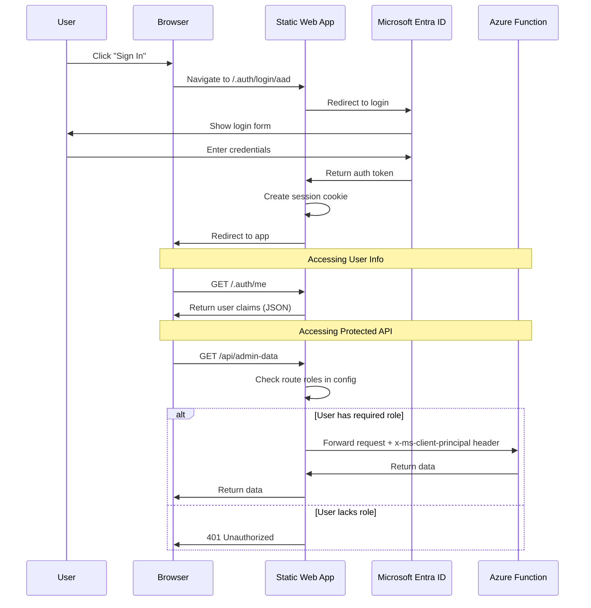

# SWA Built-in Authentication

This example demonstrates Azure Static Web Apps' **built-in authentication** with custom roles defined in configuration.

## Overview

SWA provides authentication out-of-the-box without requiring any authentication libraries in your code. Authentication is handled by the SWA platform itself.

## How It Works



## Key Differences from MSAL

| Aspect | SWA Built-in | MSAL Custom |
|--------|--------------|-------------|
| Login | `/.auth/login/aad` | `instance.loginPopup()` |
| User info | `/.auth/me` endpoint | `account.idTokenClaims` |
| Logout | `/.auth/logout` | `instance.logoutPopup()` |
| Token access | Not directly available | Full JWT access |
| Role source | `staticwebapp.config.json` | Entra ID App Roles |

## Project Structure

```
swa-builtin-auth/
├── src/
│   ├── components/
│   │   └── RequireRole.jsx      # Role-based route protection
│   ├── pages/
│   │   ├── Home.jsx             # Landing page with login
│   │   ├── Admin.jsx            # Admin-only page
│   │   └── Profile.jsx          # User profile
│   ├── App.jsx                  # Routes
│   ├── main.jsx                 # Entry point
│   └── auth.js                  # Auth helper functions
├── api/
│   └── src/functions/
│       └── admin-data.js        # Protected API endpoint
├── staticwebapp.config.json     # Route protection & roles
├── package.json
└── index.html
```

## Quick Start

### 1. Install dependencies
```bash
npm install
```

### 2. Run locally with SWA CLI
```bash
npm install -g @azure/static-web-apps-cli
swa start
```

### 3. Test authentication
- Open http://localhost:4280
- Click "Sign In" 
- SWA CLI provides mock authentication for local testing

## Configuration

### staticwebapp.config.json

```json
{
  "routes": [
    {
      "route": "/admin/*",
      "allowedRoles": ["admin"]
    },
    {
      "route": "/api/admin-data",
      "allowedRoles": ["admin"]
    },
    {
      "route": "/profile",
      "allowedRoles": ["authenticated"]
    }
  ],
  "responseOverrides": {
    "401": {
      "redirect": "/.auth/login/aad?post_login_redirect_uri=.referrer",
      "statusCode": 302
    }
  },
  "auth": {
    "rolesSource": "/api/get-roles",
    "identityProviders": {
      "azureActiveDirectory": {
        "registration": {
          "openIdIssuer": "https://login.microsoftonline.com/<TENANT_ID>/v2.0",
          "clientIdSettingName": "AAD_CLIENT_ID",
          "clientSecretSettingName": "AAD_CLIENT_SECRET"
        }
      }
    }
  }
}
```

## Built-in Endpoints

| Endpoint | Purpose |
|----------|---------|
| `/.auth/login/aad` | Sign in with Entra ID |
| `/.auth/login/github` | Sign in with GitHub |
| `/.auth/login/google` | Sign in with Google |
| `/.auth/logout` | Sign out |
| `/.auth/me` | Get current user info |
| `/.auth/purge/aad` | Clear cached credentials |

## User Info Response

Calling `/.auth/me` returns:

```json
{
  "clientPrincipal": {
    "identityProvider": "aad",
    "userId": "abc123...",
    "userDetails": "user@contoso.com",
    "userRoles": ["anonymous", "authenticated", "admin"],
    "claims": [
      { "typ": "name", "val": "John Doe" },
      { "typ": "http://schemas.xmlsoap.org/ws/2005/05/identity/claims/emailaddress", "val": "user@contoso.com" }
    ]
  }
}
```

## Custom Roles with API

To assign custom roles based on user attributes, create a roles API:

```javascript
// api/src/functions/get-roles.js
const { app } = require("@azure/functions");

app.http("get-roles", {
  methods: ["GET", "POST"],
  authLevel: "anonymous",
  handler: async (request, context) => {
    // Get the client principal from header
    const header = request.headers.get("x-ms-client-principal");
    
    if (!header) {
      return { jsonBody: { roles: [] } };
    }
    
    const principal = JSON.parse(Buffer.from(header, "base64").toString("utf8"));
    const email = principal.userDetails;
    
    // Custom logic to determine roles
    const roles = [];
    
    // Example: Admin emails
    const adminEmails = ["admin@contoso.com", "owner@contoso.com"];
    if (adminEmails.includes(email)) {
      roles.push("admin");
    }
    
    return { jsonBody: { roles } };
  }
});
```

## Deployment

### GitHub Actions

```yaml
- name: Deploy Static Web App
  uses: Azure/static-web-apps-deploy@v1
  with:
    azure_static_web_apps_api_token: ${{ secrets.SWA_DEPLOYMENT_TOKEN }}
    action: "upload"
    app_location: "/swa-builtin-auth"
    api_location: "/swa-builtin-auth/api"
    output_location: "dist"
```

### Configure Entra ID (Optional)

For production with Entra ID:

1. Create App Registration in Entra ID
2. Add client secret
3. Configure in SWA:
   - Go to Azure Portal → Your SWA → Settings → Configuration
   - Add `AAD_CLIENT_ID` and `AAD_CLIENT_SECRET`

## Limitations

- No direct access to JWT tokens
- Roles must be defined in config or via API
- Limited customization of login UI
- Session-based (no refresh tokens)

## When to Use This Pattern

✅ **Good fit:**
- Simple authentication needs
- Quick prototypes
- Apps using multiple social providers
- When you don't need token claims

❌ **Consider MSAL instead:**
- Need access to full JWT claims
- Complex permission requirements
- Calling external APIs with bearer tokens
- Custom token validation logic
